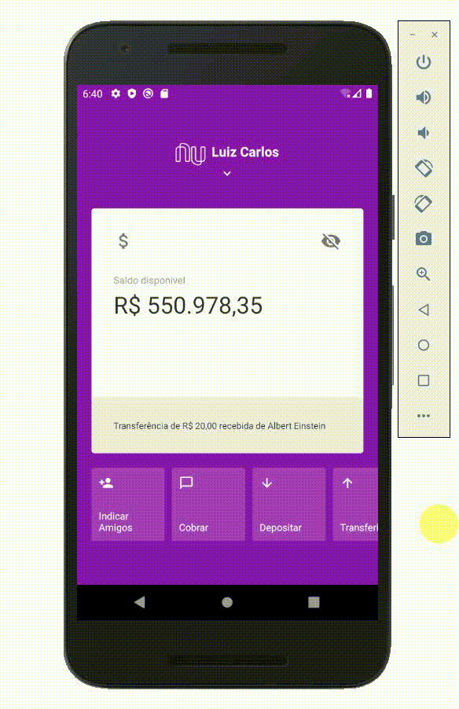

</br>
<p align="center">
  <a href="https://www.youtube.com/watch?v=ENWGf4FKtqw" target=_blank>
    
  </a>
  </br>
  <h1 align="center">Clone Da Interface Nubank</h1>
</p>

#### Passo Adicional no Android

Para que os gestos sejam habilitados no Android é necessário um passo a mais, que é bem simples, abra o arquivo `android/app/src/main/java/<pacote_do_projeto>/MainActivity.java`, e começe importando os pacotes como abaixo:

```java
// ...
import com.facebook.react.ReactActivity;
// Importações adicionadas
import com.facebook.react.ReactActivityDelegate;
import com.facebook.react.ReactRootView;
import com.swmansion.gesturehandler.react.RNGestureHandlerEnabledRootView;
```

Feito a importação vamos criar um método novo, logo abaixo do `getMainComponentName()`, ficando:

```java
public class MainActivity extends ReactActivity {
  @Override
  protected String getMainComponentName() { ... }
  // Método adicionado
  @Override
  protected ReactActivityDelegate createReactActivityDelegate() {
    return new ReactActivityDelegate(this, getMainComponentName()) {
      @Override
      protected ReactRootView createRootView() {
        return new RNGestureHandlerEnabledRootView(MainActivity.this);
      }
    };
  }
}
```

<!-- CONTACT -->

## Contato

Carlos Morais - [LinkedIn](https://www.linkedin.com/in/carlosmorais01) - **https://www.linkedin.com/in/carlosmorais01/**
